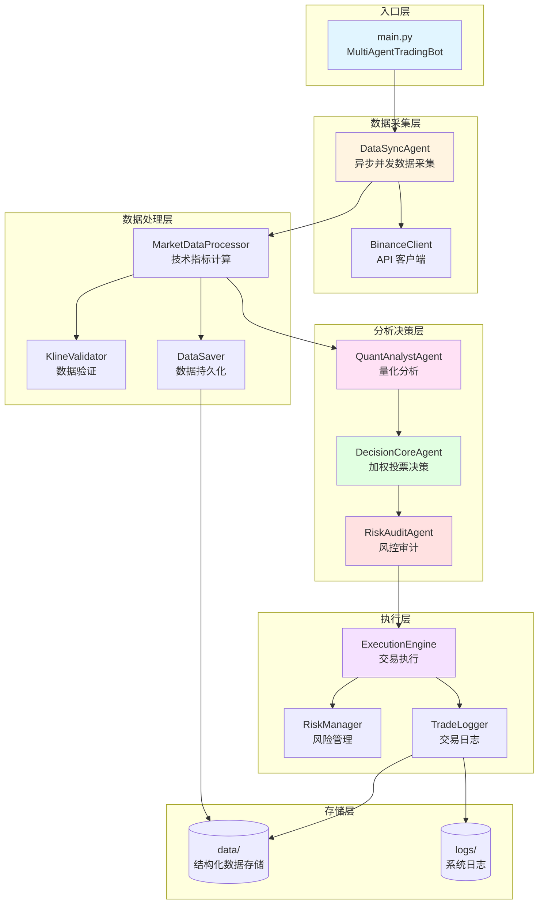
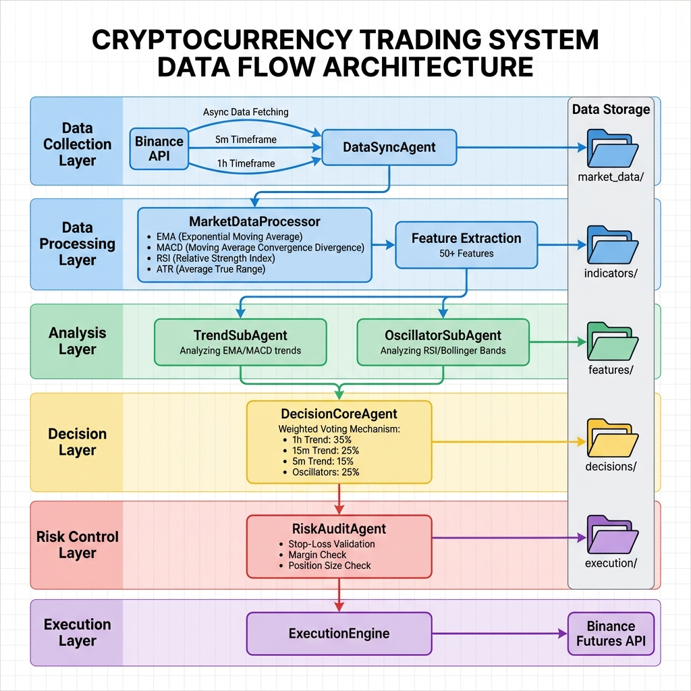
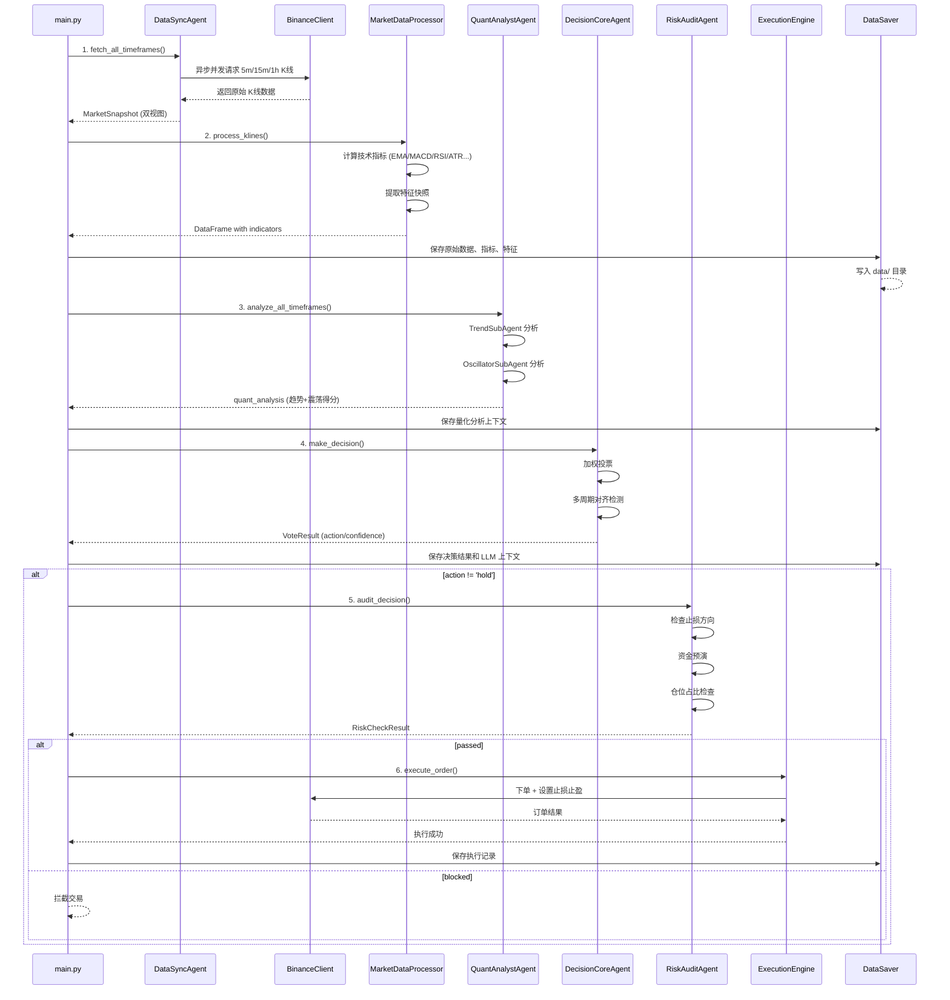

# 🤖 LLM-TradeBot 数据流转分析文档

> **项目类型**: 基于 LLM (DeepSeek) 的智能多 Agent 量化交易机器人  
> **核心架构**: Multi-Agent 协作 + 异步数据采集 + 全链路审计  
> **分析时间**: 2025-12-20

---

## 📋 目录

1. [系统架构概览](#系统架构概览)
2. [核心数据流转](#核心数据流转)
3. [关键模块详解](#关键模块详解)
4. [数据存储结构](#数据存储结构)
5. [文件清单](#文件清单)

---

## 系统架构概览

### 整体架构图



### 核心特性

- **异步并发**: 使用 `asyncio.gather` 并发获取多周期数据，减少 60% 等待时间
- **双视图数据**: `stable_view` (已完成 K 线) + `live_view` (实时价格)
- **多 Agent 协作**: 4 个专业 Agent 分工协作完成交易全流程
- **全链路审计**: 每个环节的中间数据都保存到 `data/` 目录
- **风控拦截**: 一票否决机制，严格风险控制

### 数据流转可视化



---

## 核心数据流转

### 完整交易循环流程



### 数据流转阶段详解

#### 阶段 1: 数据采集 (DataSyncAgent)

**输入**: 交易对 (symbol), K线数量 (limit)  
**处理**:

- 异步并发请求 3 个时间周期 (5m, 15m, 1h)
- 拆分为 `stable_view` (iloc[:-1]) 和 `live_view` (iloc[-1])
- 时间对齐验证

**输出**: `MarketSnapshot` 对象

```python
@dataclass
class MarketSnapshot:
    stable_5m: pd.DataFrame    # 已完成的 5 分钟 K 线
    stable_15m: pd.DataFrame   # 已完成的 15 分钟 K 线
    stable_1h: pd.DataFrame    # 已完成的 1 小时 K 线
    live_5m: Dict              # 当前未完成的 5 分钟 K 线
    live_15m: Dict             # 当前未完成的 15 分钟 K 线
    live_1h: Dict              # 当前未完成的 1 小时 K 线
    raw_5m: List[Dict]         # 原始 5 分钟数据
    raw_15m: List[Dict]        # 原始 15 分钟数据
    raw_1h: List[Dict]         # 原始 1 小时数据
    timestamp: datetime
    alignment_ok: bool
    fetch_duration: float
```

**数据保存**:

- `data/market_data/{date}/{symbol}_{timeframe}_{timestamp}.{json|csv|parquet}`

---

#### 阶段 2: 技术指标计算 (MarketDataProcessor)

**输入**: 原始 K 线数据 (List[Dict])  
**处理**:

1. **数据验证**: KlineValidator 检查数据完整性
2. **指标计算**:
   - 趋势指标: SMA(20, 50), EMA(12, 26), MACD(12, 26, 9)
   - 动量指标: RSI(14), Stochastic
   - 波动率: ATR, Bollinger Bands
   - 成交量: OBV, Volume Ratio, VWAP
3. **Warmup 期标记**: 前 105 根 K 线标记为不稳定期
4. **特征提取**: 50+ 特征 (价格变化率、指标交叉、支撑阻力等)

**输出**:

- `df_with_indicators`: 包含所有技术指标的 DataFrame
- `features_df`: 特征快照 DataFrame

**数据保存**:

- `data/indicators/{date}/{symbol}_{timeframe}_{snapshot_id}.parquet`
- `data/features/{date}/{symbol}_{timeframe}_{snapshot_id}_v1.parquet`

---

#### 阶段 3: 量化分析 (QuantAnalystAgent)

**输入**: `MarketSnapshot` (带指标的 DataFrame)  
**处理**:

**3.1 趋势分析 (TrendSubAgent)**

- 1h EMA 金叉/死叉 → ±40 分
- 15m MACD 扩大/收缩 → ±30 分
- 5m 价格突破 → ±30 分
- live_view 实时修正 → ±20 分

**3.2 震荡分析 (OscillatorSubAgent)**

- 1h RSI 超买/超卖 → ±80 分
- 5m RSI 极端值 → ±80 分
- live_view 实时 RSI → ±20 分

**输出**: `quant_analysis` 字典

```python
{
    'trend_5m': {'score': -20, 'signal': 'weak_short', ...},
    'trend_15m': {'score': 45, 'signal': 'moderate_long', ...},
    'trend_1h': {'score': 60, 'signal': 'strong_long', ...},
    'oscillator_5m': {'score': -30, ...},
    'oscillator_15m': {'score': 10, ...},
    'oscillator_1h': {'score': 25, ...},
    'comprehensive': {
        'volatility': 0.15,
        'trend_strength': 'moderate',
        'overall_bias': 'bullish'
    }
}
```

**数据保存**:

- `data/context/{date}/{symbol}_quant_analysis_{snapshot_id}.json`

---

#### 阶段 4: 加权投票决策 (DecisionCoreAgent)

**输入**: `quant_analysis` 字典  
**处理**:

**4.1 加权投票**

```python
weights = {
    'trend_5m': 0.15,
    'trend_15m': 0.25,
    'trend_1h': 0.35,      # 最高权重
    'oscillator_5m': 0.08,
    'oscillator_15m': 0.12,
    'oscillator_1h': 0.15
}

weighted_score = Σ(signal_score * weight)
```

**4.2 多周期对齐检测**

- 三周期同向 → 强对齐 (提升置信度)
- 1h + 15m 同向 → 部分对齐
- 其他 → 不对齐

**4.3 动作映射**

- `weighted_score > 50` 且对齐 → `long` (high confidence)
- `weighted_score > 30` → `long` (medium confidence)
- `weighted_score < -50` 且对齐 → `short` (high confidence)
- `weighted_score < -30` → `short` (medium confidence)
- 其他 → `hold`

**输出**: `VoteResult` 对象

```python
@dataclass
class VoteResult:
    action: str                      # 'long' / 'short' / 'hold'
    confidence: float                # 0.0 - 1.0
    weighted_score: float            # 加权得分
    vote_details: Dict[str, float]   # 各信号得分
    multi_period_aligned: bool       # 是否多周期对齐
    reason: str                      # 决策原因
```

**数据保存**:

- `data/decisions/{date}/{symbol}_{snapshot_id}.json`
- `data/llm_logs/{date}/{symbol}_{snapshot_id}.md` (LLM 上下文)

---

#### 阶段 5: 风控审计 (RiskAuditAgent)

**输入**:

- `decision`: 订单参数
- `current_position`: 当前持仓
- `account_balance`: 账户余额
- `current_price`: 当前价格

**处理**:

**5.1 止损方向自动修正** (致命错误检测)

- 做多: 止损必须 < 入场价
- 做空: 止损必须 > 入场价
- 自动修正错误方向

**5.2 资金预演**

```python
required_margin = (quantity * entry_price) / leverage
if required_margin > account_balance * 0.95:
    BLOCK
```

**5.3 仓位占比检查**

```python
position_value = quantity * entry_price
position_pct = position_value / account_balance
if position_pct > max_position_pct:
    BLOCK
```

**5.4 风险敞口检查**

```python
risk_exposure = abs(entry_price - stop_loss) * quantity
risk_pct = risk_exposure / account_balance
if risk_pct > max_total_risk_pct:
    BLOCK
```

**输出**: `RiskCheckResult` 对象

```python
@dataclass
class RiskCheckResult:
    passed: bool                    # 是否通过审计
    risk_level: RiskLevel          # SAFE/WARNING/DANGER/FATAL
    blocked_reason: Optional[str]  # 拦截原因
    corrections: Optional[Dict]    # 自动修正项
    warnings: List[str]            # 警告信息
```

---

#### 阶段 6: 交易执行 (ExecutionEngine)

**输入**: 经过风控审计的订单参数  
**处理**:

1. 设置杠杆: `client.set_leverage()`
2. 市价开仓: `client.place_futures_market_order()`
3. 设置止损止盈: `execution_engine.set_stop_loss_take_profit()`
4. 记录交易日志: `trade_logger.log_open_position()`

**输出**: 执行结果 (成功/失败)

**数据保存**:

- `data/execution/{date}/{symbol}_{timestamp}.json`
- `logs/trades/{date}/trade_{timestamp}.json` (TradeLogger)

---

## 关键模块详解

### 1. 数据采集模块

| 文件 | 职责 | 核心功能 |
|------|------|----------|
| [src/agents/data_sync_agent.py](file:///Users/yunxuanhan/Documents/workspace/ai/LLM-TradeBot/src/agents/data_sync_agent.py) | 数据同步官 | 异步并发采集、双视图拆分、时间对齐 |
| [src/api/binance_client.py](file:///Users/yunxuanhan/Documents/workspace/ai/LLM-TradeBot/src/api/binance_client.py) | Binance API 封装 | K线获取、订单执行、账户查询 |

**关键数据结构**:

- `MarketSnapshot`: 市场快照 (双视图)
- `stable_view`: 已完成 K 线 (用于指标计算)
- `live_view`: 实时价格 (用于实时修正)

---

### 2. 数据处理模块

| 文件 | 职责 | 核心功能 |
|------|------|----------|
| [src/data/processor.py](file:///Users/yunxuanhan/Documents/workspace/ai/LLM-TradeBot/src/data/processor.py) | 市场数据处理器 | 技术指标计算、特征提取、趋势检测 |
| [src/data/kline_validator.py](file:///Users/yunxuanhan/Documents/workspace/ai/LLM-TradeBot/src/data/kline_validator.py) | K线数据验证 | 数据完整性检查、异常值过滤 |
| [src/data/validator.py](file:///Users/yunxuanhan/Documents/workspace/ai/LLM-TradeBot/src/data/validator.py) | 通用数据验证 | 数据质量检查 |

**技术指标列表**:

- **趋势**: SMA(20, 50), EMA(12, 26), MACD(12, 26, 9)
- **动量**: RSI(14), Stochastic Oscillator
- **波动率**: ATR, Bollinger Bands
- **成交量**: OBV, Volume Ratio, VWAP

**特征工程** (50+ 特征):

- 价格变化率 (1/3/5/10/20 周期)
- 指标交叉信号 (EMA 金叉/死叉, MACD 柱状图)
- 支撑阻力位距离
- 波动率指标 (ATR/价格比)
- 成交量异常检测

---

### 3. 分析决策模块

| 文件 | 职责 | 核心功能 |
|------|------|----------|
| [src/agents/quant_analyst_agent.py](file:///Users/yunxuanhan/Documents/workspace/ai/LLM-TradeBot/src/agents/quant_analyst_agent.py) | 量化分析师 | 趋势分析、震荡分析、综合评分 |
| [src/agents/decision_core_agent.py](file:///Users/yunxuanhan/Documents/workspace/ai/LLM-TradeBot/src/agents/decision_core_agent.py) | 决策中枢 | 加权投票、多周期对齐、动作映射 |
| [src/agents/risk_audit_agent.py](file:///Users/yunxuanhan/Documents/workspace/ai/LLM-TradeBot/src/agents/risk_audit_agent.py) | 风控审计官 | 止损修正、资金预演、风险拦截 |

**QuantAnalystAgent 子 Agent**:

- `TrendSubAgent`: 趋势分析 (EMA/MACD)
- `OscillatorSubAgent`: 震荡分析 (RSI/BB)

**DecisionCoreAgent 权重配置**:

```python
@dataclass
class SignalWeight:
    trend_5m: float = 0.15
    trend_15m: float = 0.25
    trend_1h: float = 0.35        # 最高权重
    oscillator_5m: float = 0.08
    oscillator_15m: float = 0.12
    oscillator_1h: float = 0.15
```

**RiskAuditAgent 风控参数**:

```python
max_leverage: float = 10.0           # 最大杠杆
max_position_pct: float = 0.3        # 最大单仓位占比 30%
max_total_risk_pct: float = 0.02     # 最大总风险敞口 2%
min_stop_loss_pct: float = 0.005     # 最小止损距离 0.5%
max_stop_loss_pct: float = 0.05      # 最大止损距离 5%
```

---

### 4. 执行监控模块

| 文件 | 职责 | 核心功能 |
|------|------|----------|
| [src/execution/engine.py](file:///Users/yunxuanhan/Documents/workspace/ai/LLM-TradeBot/src/execution/engine.py) | 交易执行引擎 | 订单执行、止损止盈设置 |
| [src/risk/manager.py](file:///Users/yunxuanhan/Documents/workspace/ai/LLM-TradeBot/src/risk/manager.py) | 风险管理器 | 实时风险监控 |
| [src/utils/trade_logger.py](file:///Users/yunxuanhan/Documents/workspace/ai/LLM-TradeBot/src/utils/trade_logger.py) | 交易日志记录 | 全生命周期追踪 |

---

### 5. 数据持久化模块

| 文件 | 职责 | 核心功能 |
|------|------|----------|
| [src/utils/data_saver.py](file:///Users/yunxuanhan/Documents/workspace/ai/LLM-TradeBot/src/utils/data_saver.py) | 数据保存工具 | 按日期组织、多格式保存 |
| [src/utils/logger.py](file:///Users/yunxuanhan/Documents/workspace/ai/LLM-TradeBot/src/utils/logger.py) | 系统日志 | 运行日志记录 |

**DataSaver 保存方法**:

- `save_market_data()`: 原始 K 线 (JSON/CSV/Parquet)
- `save_indicators()`: 技术指标 (Parquet)
- `save_features()`: 特征快照 (Parquet)
- `save_context()`: Agent 上下文 (JSON)
- `save_llm_log()`: LLM 交互日志 (Markdown)
- `save_decision()`: 决策结果 (JSON)
- `save_execution()`: 执行记录 (JSON)

---

## 数据存储结构

### 目录组织

```
data/
├── market_data/              # 原始市场数据
│   └── {date}/
│       ├── BTCUSDT_5m_{timestamp}.json
│       ├── BTCUSDT_5m_{timestamp}.csv
│       ├── BTCUSDT_5m_{timestamp}.parquet
│       ├── BTCUSDT_15m_{timestamp}.json
│       └── BTCUSDT_1h_{timestamp}.json
│
├── indicators/               # 技术指标数据
│   └── {date}/
│       ├── BTCUSDT_5m_{snapshot_id}.parquet
│       ├── BTCUSDT_15m_{snapshot_id}.parquet
│       └── BTCUSDT_1h_{snapshot_id}.parquet
│
├── features/                 # 特征快照
│   └── {date}/
│       ├── BTCUSDT_5m_{snapshot_id}_v1.parquet
│       ├── BTCUSDT_15m_{snapshot_id}_v1.parquet
│       └── BTCUSDT_1h_{snapshot_id}_v1.parquet
│
├── context/                  # Agent 分析上下文
│   └── {date}/
│       └── BTCUSDT_quant_analysis_{snapshot_id}.json
│
├── llm_logs/                 # LLM 交互日志
│   └── {date}/
│       └── BTCUSDT_{snapshot_id}.md
│
├── decisions/                # 决策结果
│   └── {date}/
│       └── BTCUSDT_{snapshot_id}.json
│
└── execution/                # 执行记录
    └── {date}/
        └── BTCUSDT_{timestamp}.json

logs/
├── app.log                   # 系统运行日志
└── trades/                   # 交易详细日志
    └── {date}/
        └── trade_{timestamp}.json
```

### 数据格式示例

#### MarketSnapshot (市场快照)

```python
{
    "stable_5m": DataFrame(300 rows),  # 已完成的 5 分钟 K 线
    "live_5m": {
        "open": 95000.0,
        "high": 95500.0,
        "low": 94800.0,
        "close": 95200.0,
        "volume": 1234.56
    },
    "timestamp": "2025-12-20T19:45:00",
    "alignment_ok": true,
    "fetch_duration": 0.85
}
```

#### QuantAnalysis (量化分析)

```json
{
    "trend_5m": {
        "score": -20,
        "signal": "weak_short",
        "ema_cross": "death_cross",
        "macd_histogram": "negative"
    },
    "trend_15m": {
        "score": 45,
        "signal": "moderate_long",
        "ema_cross": "golden_cross",
        "macd_histogram": "positive"
    },
    "trend_1h": {
        "score": 60,
        "signal": "strong_long",
        "ema_cross": "golden_cross",
        "macd_histogram": "expanding"
    },
    "oscillator_1h": {
        "score": 25,
        "signal": "neutral",
        "rsi": 58.5,
        "bb_position": "middle"
    },
    "comprehensive": {
        "volatility": 0.15,
        "trend_strength": "moderate",
        "overall_bias": "bullish"
    }
}
```

#### VoteResult (投票结果)

```json
{
    "action": "long",
    "confidence": 0.78,
    "weighted_score": 52.5,
    "vote_details": {
        "trend_5m": -3.0,
        "trend_15m": 11.25,
        "trend_1h": 21.0,
        "oscillator_5m": -2.4,
        "oscillator_15m": 1.2,
        "oscillator_1h": 3.75
    },
    "multi_period_aligned": true,
    "reason": "1h 和 15m 强势金叉，多周期对齐，建议做多"
}
```

#### RiskCheckResult (风控结果)

```json
{
    "passed": true,
    "risk_level": "WARNING",
    "blocked_reason": null,
    "corrections": {
        "stop_loss": 94000.0  // 自动修正止损方向
    },
    "warnings": [
        "仓位占比 28% 接近上限 30%",
        "当前杠杆 5x 较高"
    ]
}
```

---

## 文件清单

### 核心源代码 (src/)

#### 1. Agent 模块 (src/agents/)

| 文件 | 行数 | 职责 |
|------|------|------|
| [data_sync_agent.py](file:///Users/yunxuanhan/Documents/workspace/ai/LLM-TradeBot/src/agents/data_sync_agent.py) | 325 | 异步数据采集、双视图拆分 |
| [quant_analyst_agent.py](file:///Users/yunxuanhan/Documents/workspace/ai/LLM-TradeBot/src/agents/quant_analyst_agent.py) | 453 | 趋势+震荡分析、量化评分 |
| [decision_core_agent.py](file:///Users/yunxuanhan/Documents/workspace/ai/LLM-TradeBot/src/agents/decision_core_agent.py) | 459 | 加权投票、多周期对齐决策 |
| [risk_audit_agent.py](file:///Users/yunxuanhan/Documents/workspace/ai/LLM-TradeBot/src/agents/risk_audit_agent.py) | 648 | 风控审计、止损修正、资金预演 |

#### 2. 数据处理模块 (src/data/)

| 文件 | 行数 | 职责 |
|------|------|------|
| [processor.py](file:///Users/yunxuanhan/Documents/workspace/ai/LLM-TradeBot/src/data/processor.py) | 853 | 技术指标计算、特征提取 |
| [kline_validator.py](file:///Users/yunxuanhan/Documents/workspace/ai/LLM-TradeBot/src/data/kline_validator.py) | ~300 | K线数据验证和清洗 |
| [validator.py](file:///Users/yunxuanhan/Documents/workspace/ai/LLM-TradeBot/src/data/validator.py) | ~400 | 通用数据验证 |

#### 3. API 模块 (src/api/)

| 文件 | 职责 |
|------|------|
| binance_client.py | Binance Futures API 封装 |

#### 4. 执行模块 (src/execution/)

| 文件 | 职责 |
|------|------|
| [engine.py](file:///Users/yunxuanhan/Documents/workspace/ai/LLM-TradeBot/src/execution/engine.py) | 交易执行引擎 |

#### 5. 风控模块 (src/risk/)

| 文件 | 职责 |
|------|------|
| manager.py | 风险管理器 |

#### 6. 特征工程 (src/features/)

| 文件 | 职责 |
|------|------|
| builder.py | 特征构建器 |
| technical_features.py | 技术特征提取 |

#### 7. 工具模块 (src/utils/)

| 文件 | 职责 |
|------|------|
| [data_saver.py](file:///Users/yunxuanhan/Documents/workspace/ai/LLM-TradeBot/src/utils/data_saver.py) | 数据持久化 |
| [trade_logger.py](file:///Users/yunxuanhan/Documents/workspace/ai/LLM-TradeBot/src/utils/trade_logger.py) | 交易日志记录 |
| [logger.py](file:///Users/yunxuanhan/Documents/workspace/ai/LLM-TradeBot/src/utils/logger.py) | 系统日志 |
| data_alignment.py | 数据对齐工具 |
| data_flow_logger.py | 数据流日志 |
| pipeline_logger.py | 管道日志 |

### 主程序入口

| 文件 | 行数 | 职责 |
|------|------|------|
| [main.py](file:///Users/yunxuanhan/Documents/workspace/ai/LLM-TradeBot/main.py) | 539 | 多 Agent 主循环、统一入口 |
| run_multi_agent.py | ~500 | 多 Agent 运行脚本 (备用) |

### 配置文件

| 文件 | 职责 |
|------|------|
| config.yaml | 交易参数配置 |
| .env | API 密钥配置 |
| requirements.txt | Python 依赖 |

---

## 关键数据流转路径总结

### 路径 1: 市场数据 → 技术指标

```
BinanceClient.get_klines()
  ↓
DataSyncAgent.fetch_all_timeframes()
  ↓ (异步并发)
MarketSnapshot (双视图)
  ↓
MarketDataProcessor.process_klines()
  ↓
DataFrame with 技术指标 (EMA/MACD/RSI/ATR...)
  ↓
DataSaver.save_indicators()
  ↓
data/indicators/{date}/{symbol}_{timeframe}_{snapshot_id}.parquet
```

### 路径 2: 技术指标 → 特征快照

```
DataFrame with 技术指标
  ↓
MarketDataProcessor.extract_feature_snapshot()
  ↓
特征 DataFrame (50+ 特征)
  ↓
DataSaver.save_features()
  ↓
data/features/{date}/{symbol}_{timeframe}_{snapshot_id}_v1.parquet
```

### 路径 3: 特征 → 量化分析

```
MarketSnapshot (带指标)
  ↓
QuantAnalystAgent.analyze_all_timeframes()
  ↓ (并行)
TrendSubAgent.analyze() + OscillatorSubAgent.analyze()
  ↓
quant_analysis (趋势+震荡得分)
  ↓
DataSaver.save_context()
  ↓
data/context/{date}/{symbol}_quant_analysis_{snapshot_id}.json
```

### 路径 4: 量化分析 → 决策

```
quant_analysis
  ↓
DecisionCoreAgent.make_decision()
  ↓ (加权投票)
VoteResult (action/confidence/reason)
  ↓
DataSaver.save_decision()
  ↓
data/decisions/{date}/{symbol}_{snapshot_id}.json
```

### 路径 5: 决策 → 风控 → 执行

```
VoteResult
  ↓
RiskAuditAgent.audit_decision()
  ↓ (风控检查)
RiskCheckResult (passed/blocked/corrections)
  ↓ (if passed)
ExecutionEngine.execute_order()
  ↓
BinanceClient.place_futures_market_order()
  ↓
TradeLogger.log_open_position()
  ↓
data/execution/{date}/{symbol}_{timestamp}.json
logs/trades/{date}/trade_{timestamp}.json
```

---

## 数据流转优化点

### 1. 异步并发优化

- 使用 `asyncio.gather()` 并发请求 3 个时间周期
- 减少 60% 数据采集等待时间
- 代码位置: [data_sync_agent.py:76-153](file:///Users/yunxuanhan/Documents/workspace/ai/LLM-TradeBot/src/agents/data_sync_agent.py#L76-L153)

### 2. 双视图数据结构

- `stable_view`: 已完成 K 线 (用于指标计算)
- `live_view`: 实时价格 (用于实时修正)
- 解决数据滞后问题
- 代码位置: [data_sync_agent.py:24-52](file:///Users/yunxuanhan/Documents/workspace/ai/LLM-TradeBot/src/agents/data_sync_agent.py#L24-L52)

### 3. Warmup 期标记

- 前 105 根 K 线标记为不稳定期
- 避免使用未收敛的指标
- 代码位置: [processor.py:290-351](file:///Users/yunxuanhan/Documents/workspace/ai/LLM-TradeBot/src/data/processor.py#L290-L351)

### 4. 止损方向自动修正

- 检测并修正致命错误 (做多止损>入场价)
- 一票否决机制
- 代码位置: [risk_audit_agent.py:263-362](file:///Users/yunxuanhan/Documents/workspace/ai/LLM-TradeBot/src/agents/risk_audit_agent.py#L263-L362)

### 5. 全链路数据审计

- 每个环节的中间数据都保存
- 方便复盘和调试
- 代码位置: [data_saver.py](file:///Users/yunxuanhan/Documents/workspace/ai/LLM-TradeBot/src/utils/data_saver.py)

---

## 总结

### 核心数据流转链路

```
市场数据采集 → 技术指标计算 → 特征提取 → 量化分析 → 加权投票决策 → 风控审计 → 交易执行
```

### 关键设计模式

1. **Multi-Agent 协作**: 4 个专业 Agent 分工明确
2. **异步并发**: 减少 IO 等待时间
3. **双视图数据**: 解决数据滞后问题
4. **全链路审计**: 中间数据完整保存
5. **一票否决风控**: 严格风险控制

### 数据持久化策略

- **按日期组织**: `data/{category}/{date}/`
- **多格式保存**: JSON (可读) + CSV (兼容) + Parquet (高效)
- **快照 ID**: 每次循环生成唯一 `snapshot_id`
- **完整追溯**: 从原始数据到执行结果全程可追溯

---

**文档生成时间**: 2025-12-20  
**项目版本**: Multi-Agent Architecture  
**最后更新**: 项目重命名为 LLM-TradeBot
